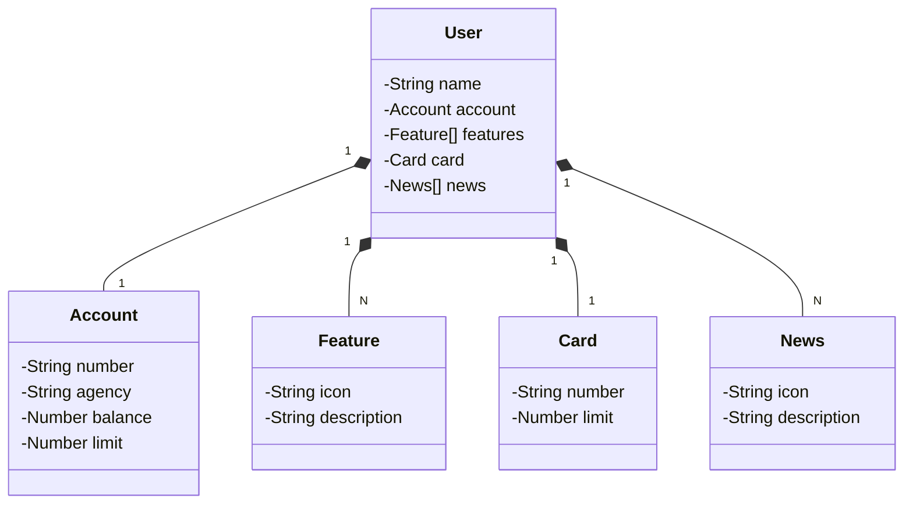
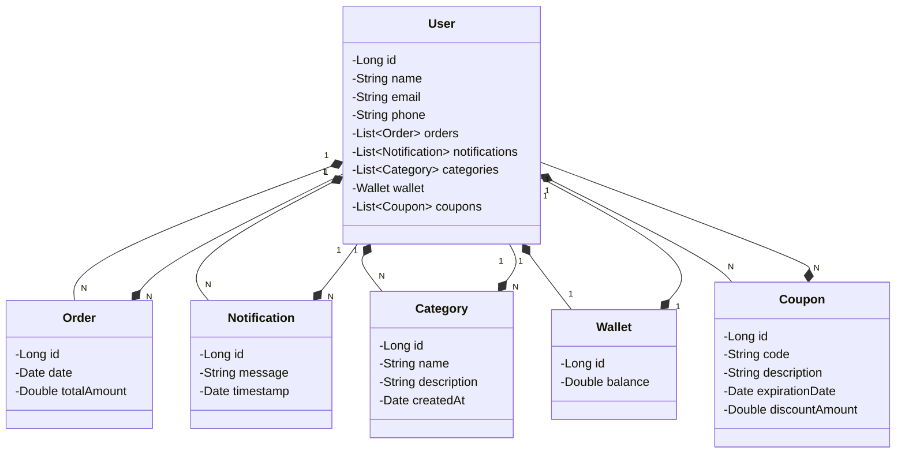

Projeto RESTfull API Java

-- Diagrama de Classes --

```mermaid
classDiagram
  class User {
    -String name
    -Account account
    -Feature[] features
    -Card card
    -News[] news
  }

  class Account {
    -String number
    -String agency
    -Number balance
    -Number limit
  }

  class Feature {
    -String icon
    -String description
  }

  class Card {
    -String number
    -Number limit
  }

  class News {
    -String icon
    -String description
  }

  User "1" *-- "1" Account
  User "1" *-- "N" Feature
  User "1" *-- "1" Card
  User "1" *-- "N" News
```

Novo domínio criado, foi utilizado como template uma aplicação de delivery de comida

-- Diagrama de Classe do Novo Domínio --

```mermaid
classDiagram
  class User {
    -Long id
    -String name
    -String email
    -String phone
    -List~Order~ orders
    -List~Notification~ notifications
    -List~Category~ categories
    -Wallet wallet
    -List~Coupon~ coupons
  }

  class Order {
    -Long id
    -Date date
    -Double totalAmount
  }

  class Notification {
    -Long id
    -String message
    -Date timestamp
  }

  class Category {
    -Long id
    -String name
    -String description
    -Date createdAt
  }

  class Wallet {
    -Long id
    -Double balance
  }

  class Coupon {
    -Long id
    -String code
    -String description
    -Date expirationDate
    -Double discountAmount
  }

  User "1" *-- "N" Order
  User "1" *-- "N" Notification
  User "1" *-- "N" Category
  User "1" *-- "1" Wallet
  User "1" *-- "N" Coupon
  Order "N" *-- "1" User
  Notification "N" *-- "1" User
  Category "N" *-- "1" User
  Wallet "1" *-- "1" User
  Coupon "N" *-- "1" User
```
